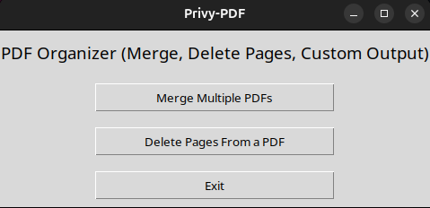
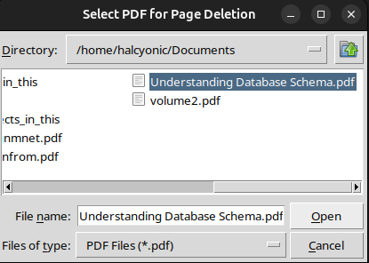

# 🧩 PrivyPDF

**PrivyPDF** is a lightweight, privacy-first desktop PDF editor built using **Python**, **Tkinter**, and **PyPDF**.  
It allows you to **merge** multiple PDFs or **delete pages** from a PDF — all directly on your local computer, without uploading anything to the cloud.

---

## 💡 Motivation

I created PrivyPDF because I didn’t want to use **online PDF editing tools** that require uploading personal or confidential documents.  
Even though most sites claim they don’t store uploaded files, we can never be entirely sure.  
So I built a **local tool** that keeps everything private and secure on my own computer.

---

## 🚀 Features

- 🧱 **Merge PDFs:** Combine multiple PDF files into one.  
- 🗑️ **Delete Pages:** Remove specific pages or ranges with flexible input (like `1,3,5-10,-4,20-` etc).  
- 🔒 **Privacy-Focused:** 100% offline. No document ever leaves your device.  
- 💻 **Cross-Platform:** Works on both **Windows** and **Linux** (tested).  


---
## 🧰 Tech Stack

- **Language:** Python  
- **GUI:** Tkinter  
- **PDF Library:** PyPDF  
- **Build Tool:** PyInstaller  

---


## 📦 **Download PrivyPDF**

You can download the latest version of **PrivyPDF** for your system from the **[Releases](https://github.com/nezchan0/Privy-PDF/releases)** page.

👉 **[Download Latest Release](https://github.com/nezchan0/Privy-PDF/releases/latest)**


### 🖥️ Available Versions:
| Platform | File Name |
|-----------|------------|
| 🪟 **Windows** | `PrivyPDF_windows.exe` |
| 🐧 **Ubuntu / Linux** | `PrivyPDF_linux` |


---


## ⚙️ Local Installation (Run from Source)

1. Clone the repository:
   ```bash
   git clone https://github.com/nezchan0/Privy-PDF.git
   cd PrivyPDF
   ```

2. Install dependencies:
   ```bash
   pip install -r requirements.txt
   ```
   *(Tkinter usually comes preinstalled with Python. If not then install it separately)* 

3. Run the app:
   ```bash
   python main.py
   ```

---

## 📦 Build Executable 

You can package PrivyPDF into a standalone desktop app using **PyInstaller**:

```bash
pyinstaller --onefile --windowed main.py
```

This will create a single executable in the `dist/` folder.

---

## 🖼️ Preview

| 🖥️ Main Window | ⚙️ Delete Pages Dialog |
|-----------------|-----------------------|
|  |  |


---


## 🌟 Future Ideas

- Add page reordering  
- Add drag-and-drop interface  

---

## 🧑‍💻 Author

Alok Kumar Maurya – Developer | Email: [alok05.maurya@gmail.com](alok05.maurya@gmail.com)


  